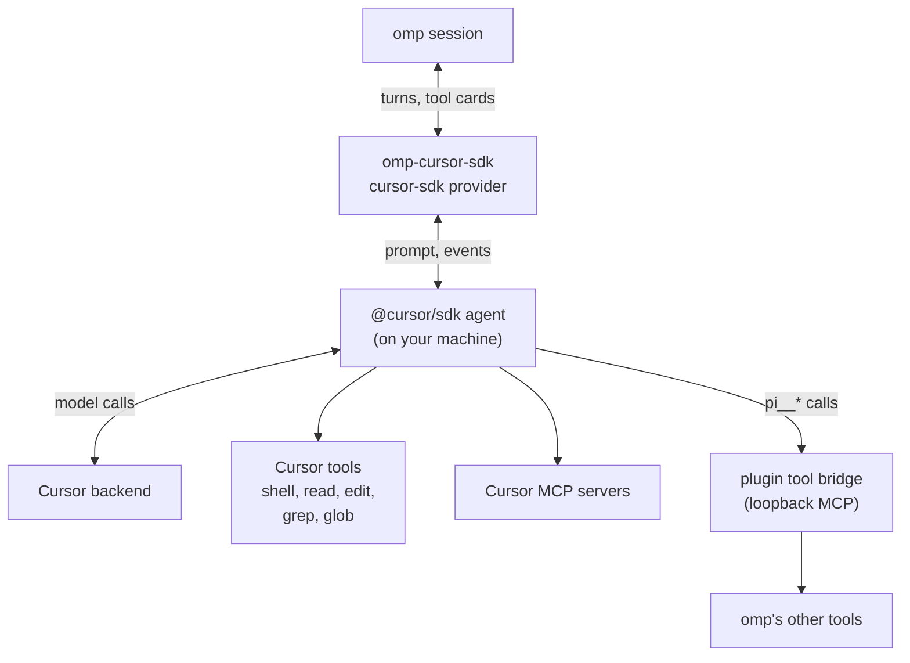
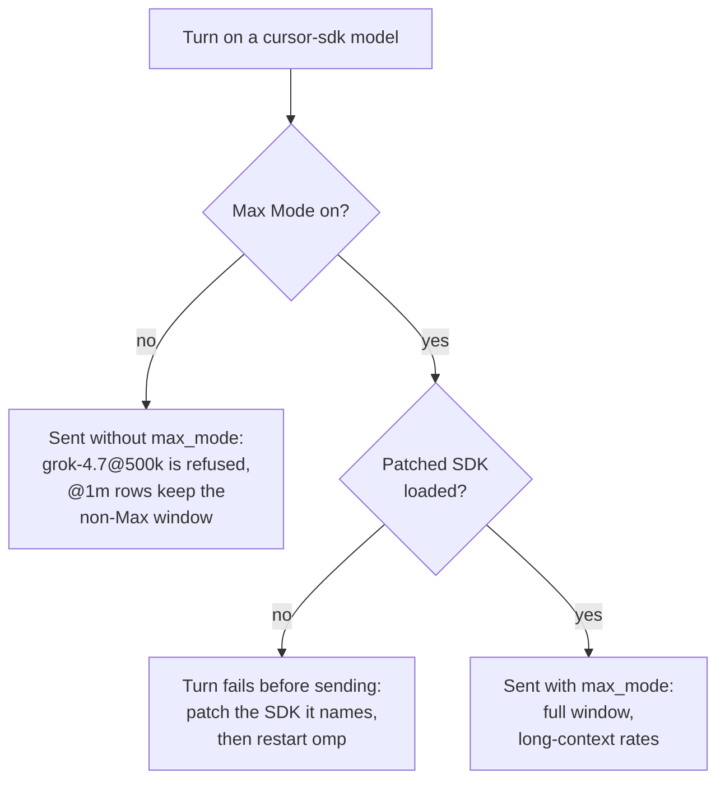

# omp-cursor-sdk

An [omp](https://github.com/can1357/oh-my-pi) plugin that registers Cursor's model catalog as the
`cursor-sdk` provider. Turns run through the official [`@cursor/sdk`](https://cursor.com/docs/sdk/typescript)
agent runtime, authenticated with a Cursor API key. It coexists with omp's built-in `cursor` provider;
the two share no models, credentials, or ids.

| | `cursor-sdk` (this plugin) | `cursor` (built into omp) |
|---|---|---|
| Auth | Cursor API key in `CURSOR_API_KEY` | omp `/login` (Cursor OAuth) |
| Transport | `@cursor/sdk` local agent loop | omp's direct Cursor agent API (`cursor-agent`) |
| Model ids | Catalog ids plus variants: `grok-4.7@256k`, `grok-4.6@fast` | Effort tiers: `grok-4.7-high`, `grok-4.7-high-fast` |

## How it works



The agent runs on your machine and calls Cursor's backend for the model. Cursor uses its own shell and
file tools, and omp shows those calls as tool cards. omp's other active tools, such as extension tools,
reach Cursor as `pi__*` through the plugin's loopback MCP bridge. The [cloud runtime](#configuration)
moves the agent to a Cursor-hosted VM.

## Install

Needs omp 18.3 or newer (tested with 18.3.4) and a Cursor user or service-account API key (Cursor
Dashboard → API Keys).

```bash
omp plugin install omp-cursor-sdk
echo 'CURSOR_API_KEY=crsr_...' >> ~/.omp/.env   # or export it
omp models cursor-sdk                            # lists the live catalog
```

Restart omp after installing, updating or changing the key: plugins and `~/.omp/.env` load at startup.
The plugin never writes the key to disk. Use the npm form above, because `github:` and git-URL specs
resolve differently across omp versions (see [Troubleshooting](#troubleshooting)). Update with
`omp plugin install omp-cursor-sdk --force`.

From a checkout (npm and Node ≥ 22.19), `omp plugin link` applies your edits on the next omp start:

```bash
git clone https://github.com/LoneExile/omp-cursor-sdk && cd omp-cursor-sdk
npm install && omp plugin link "$PWD"   # omp plugin uninstall removes the link, not the checkout
```

## Usage

```bash
omp --model cursor-sdk/composer-2.5
omp --model cursor-sdk/grok-4.7@256k --thinking xhigh
omp --model cursor-sdk/claude-opus-5@300k@slow --thinking max
omp --model cursor-sdk/gpt-5.6-sol@272k --thinking off
```

Model selector: `cursor-sdk/<model>[@<context>][@fast|@slow]`, with ids from `omp models cursor-sdk`.

- **Context**: a model with context variants exists only as `<model>@<context>` rows (`grok-4.7@256k`
  and `grok-4.7@500k`, no bare `grok-4.7`).
- **Thinking**: the model's levels are in the `thinking` column; `off` works only where Cursor has an
  off value (Claude `thinking=false`, GPT-5.4 and later `none`). Use `--thinking`:
  `--model cursor-sdk/<id>:<level>` fails with "Model not found" because omp 18.3.4 resolves `--model`
  before plugins register. In `modelRoles` the suffix works, e.g. `default: cursor-sdk/grok-4.7@256k:xhigh`.
- **Fast**: `@fast` and `@slow` pin Cursor's fast lane; otherwise the model's default applies.
  `/cursor-fast` toggles and saves it per model; `--cursor-fast` / `--cursor-no-fast` force it for one run.
- **Context windows** are measured from real runs: a bundled table, refined into
  `~/.omp/agent/cursor-sdk-context-windows.json`. Without [Max Mode](#cursor-max-mode) most `@1m`
  variants measure 200k–300k, and Cursor refuses some large variants, such as `grok-4.7@500k`.

## Cursor Max Mode

`@cursor/sdk` never sets the `max_mode` flag on Cursor's `RequestedModel`, so the plugin can send it only
through a patched SDK. Max Mode is off by default and bills at Cursor's higher long-context rates.



1. **Patch the SDK the plugin loads**, again after every `omp plugin install` or reinstall: the patch is
   local `node_modules` state and is not in the published package.

   ```bash
   # npm install: the SDK is hoisted into ~/.omp/plugins/node_modules
   cd ~/.omp/plugins/node_modules/omp-cursor-sdk
   node scripts/patch-cursor-sdk.mjs --sdk ~/.omp/plugins/node_modules/@cursor/sdk

   # checkout
   npm run patch:cursor-sdk
   ```

   `--check` (or `npm run check:cursor-sdk-patch`) reports each file without patching.
2. **Restart omp**: a running process keeps the SDK module it already loaded.
3. **Turn it on** with `--cursor-max-mode`, `PI_CURSOR_MAX_MODE=1` or `/cursor-max-mode on`
   (`--save-user` saves it to `~/.omp/agent/cursor-sdk.json`; project config cannot set it). The
   status line shows `max:on`. Precedence: `--cursor-no-max-mode` > `--cursor-max-mode` >
   `PI_CURSOR_MAX_MODE` > session toggle > user config > off.

## omp advisors

An omp advisor (`WATCHDOG.yml` or the `advisor` model role) on a cursor-sdk model gets a read-only
Cursor agent: only the `read`, `grep` and `glob` tools omp granted it, never Cursor's shell, edits, MCP
servers or subagents. On the local runtime, summaries that use omp's summarization prompt get no Cursor
tools. The cloud runtime cannot restrict tools: it refuses advisor requests, and summaries there keep
Cursor's full toolset. Advisors get no tool bridge, so without an owned dialect (`PI_DIALECT`) a
cursor-sdk advisor has no `advise` tool and its notes never reach the main session; run advisors on
another provider.

## Commands

| Command | Purpose |
|---|---|
| `/cursor-refresh-models` | Fetch the live catalog now and re-register models |
| `/cursor-fast` | Toggle fast mode for the selected model |
| `/cursor-max-mode [on\|off\|toggle] [--save-user]` | Max Mode for this session; `--save-user` writes `~/.omp/agent/cursor-sdk.json` only |
| `/cursor-mode agent\|plan` | Cursor conversation mode |
| `/cursor-runtime local\|cloud [--save-user\|--save-project]` | Local or Cursor Cloud runtime |
| `/cursor-cloud list \| archive <id> \| delete <id> --yes` | Manage recorded Cloud agents |
| `/cursor-http [on\|off\|toggle]` | HTTP/1.1/SSE transport compatibility |
| `/cursor-refresh-config` | Reload Cursor config into the current pooled agent |
| `/cursor-local-resume-cleanup [--dry-run\|--yes]` | Delete superseded local SDK agents |
| `/cursor-tools` | Tool-surface report (debug) |

Flags: `--cursor-fast`, `--cursor-no-fast`, `--cursor-max-mode`, `--cursor-no-max-mode`, `--cursor-mode <agent|plan>`, `--cursor-runtime <local|cloud>`, `--cursor-cloud-*`.

## Configuration

| Name | Meaning |
|---|---|
| `CURSOR_API_KEY` | Cursor API key (required) |
| `PI_CURSOR_MAX_MODE` | `1`/`true`/`on` or `0`/`false`/`off`: force Max Mode for the process |
| `PI_CURSOR_RUNTIME` | `local` (default) or `cloud` |
| `PI_CURSOR_SETTING_SOURCES` | Cursor settings and rules the SDK loads: `all` (default), a comma list, or `none` |
| `PI_CURSOR_SDK_MODEL_CACHE_TTL_MS` | Catalog cache TTL (default 24 h); `PI_CURSOR_SDK_DISABLE_MODEL_CACHE=1` disables the cache |
| `PI_CURSOR_SDK_EVENT_DEBUG=1` | Write raw SDK event artifacts to `.debug/cursor-sdk-events/` in the cwd |
| `~/.omp/agent/cursor-sdk.json`, `<cwd>/.omp/cursor-sdk.json` | User and project config |
| `~/.omp/agent/cursor-sdk-model-list.json` | Catalog cache |
| `~/.omp/agent/cursor-sdk-context-windows.json` | Measured context windows |

Full lists: [docs/omp-integration.md](docs/omp-integration.md), [docs/cursor-model-ux-spec.md](docs/cursor-model-ux-spec.md).

**Cloud runtime** (opt-in): `--cursor-runtime cloud` or `PI_CURSOR_RUNTIME=cloud` runs the agent in a
Cursor-hosted VM against a Git repository. First use needs `--cursor-cloud-ack` or
`PI_CURSOR_CLOUD_ACK=1`, and uncommitted or unpushed local state is rejected unless allowed.
`/cursor-cloud` lists, archives or deletes the agents it created.

## Troubleshooting

- **No `cursor-sdk` rows**: the plugin is not loaded or is disabled (`omp plugin list`). Without a key
  it shows a bundled fallback catalog, and turns fail until `CURSOR_API_KEY` is set and omp restarted.
- **`Package installed but package.json not found at …/node_modules/omp-cursor-sdk/package.json`** (or
  `…/node_modules/github:LoneExile/omp-cursor-sdk/package.json`): not every omp version maps `github:`
  and git-URL specs to the package name. A failed attempt can leave a git spec or an empty version
  (`"omp-cursor-sdk": ""`) in `~/.omp/plugins/package.json`, plus a duplicate `bun.lock` key that makes
  `bun add` exit without installing (`warn: Duplicate key … at bun.lock`). Reset and install an explicit
  version, then restart omp:

  ```bash
  cd ~/.omp/plugins
  rm -f bun.lock                 # holds the failed resolution; bun regenerates it
  bun add omp-cursor-sdk@0.4.3   # writes a real range and installs the plugin's own dependencies
  ls node_modules/omp-cursor-sdk/package.json node_modules/@cursor/sdk/package.json
  omp plugin list
  ```

  Keep one source per plugin: a `github:` install on top of the npm pin fails with
  `Package "omp-cursor-sdk@<version>" has a dependency loop`.
- **`AI Model Not Found Invalid parameters for registry model`**: Cursor refused the parameters. For a
  wider context variant, turn on [Max Mode](#cursor-max-mode) or use the smaller variant the hint names
  (`@256k` for `grok-4.7@500k`).
- **Max Mode turn fails before the request**, saying the SDK `is not patched` or
  `was patched after this process started`: patch the copy the error names, then restart omp.
- **Intermittent `unauthenticated`** with a valid key: seen from Cursor's backend; retrying, or another
  lane (`@fast`/`@slow`), has worked.
- **Refused by account policy**: some models need an acknowledgement on the Cursor side first (Claude
  Fable: "You must acknowledge Claude Fable 5's data retention policy to use the model.").
- **Stale or missing models**: the catalog is cached for 24 h; run `/cursor-refresh-models`.
- **`Command failed to spawn: …`**: Cursor could not start its shell, for example because the working
  directory does not exist or is a file (`ENOENT … posix_spawn` or `ENOTDIR`). omp stays up.
- **`Cursor's ripgrep failed to start` in the omp log**: Cursor runs ripgrep for Grep, Glob and `ls`,
  and at startup in git checkouts and `.cursor/rules` workspaces. omp stays up and Grep and Glob return
  the error. Follow the log's `hint`, which names the cause: a `CURSOR_RIPGREP_PATH` override, the
  SDK's bundled ripgrep, the working directory or a script's interpreter, or a process or open-file limit.
- **Debugging a turn**: with `PI_CURSOR_SDK_EVENT_DEBUG=1`, `.debug/cursor-sdk-events/**/metadata.json`
  holds the exact model selection sent and `wait-result.json` the SDK result. They can contain prompts
  and tool output; delete them afterwards.

## Development

```bash
npm install
npm test                                                # bun test over the port-relevant suites
npm run typecheck:src
omp -e ./src/index.ts --model cursor-sdk/composer-2.5   # run from a checkout without linking
npm run patch:cursor-sdk                                # patch this checkout's @cursor/sdk for Max Mode
npm run check:cursor-sdk-patch                          # fail if that copy is unpatched or drifted
npm run refresh:cursor-snapshots                        # dry run; add --write to update snapshots
```

An installed `omp-cursor-sdk` loads alongside `omp -e <repo>` and either copy can serve a turn; add
`--no-extensions` to run the checkout alone. Maintainer rules live in [AGENTS.md](AGENTS.md).

**Releasing**: update `CHANGELOG.md`, the `package.json` version and the `bun add` pin above, commit,
then publish a GitHub Release tagged `v<version>`. `.github/workflows/release.yml` publishes it to npm
with OIDC and provenance (skipped if the version exists; `workflow_dispatch` retries), after installing
dependencies so npm can pack the tool bridge's `bundledDependencies`. `0.4.0` was published by hand to
create the package and its trusted publisher.

## Credits and license

Port of [fitchmultz/pi-cursor-sdk](https://github.com/fitchmultz/pi-cursor-sdk) by Mitch Fultz, adapted
for omp. MIT licensed; see [LICENSE](LICENSE).
