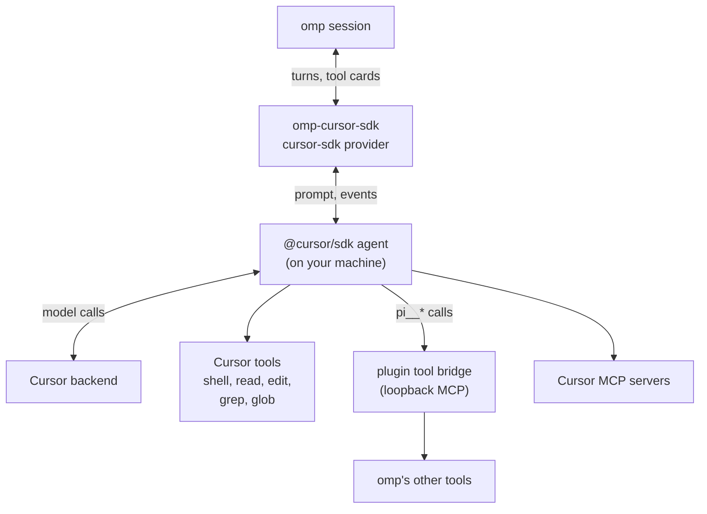
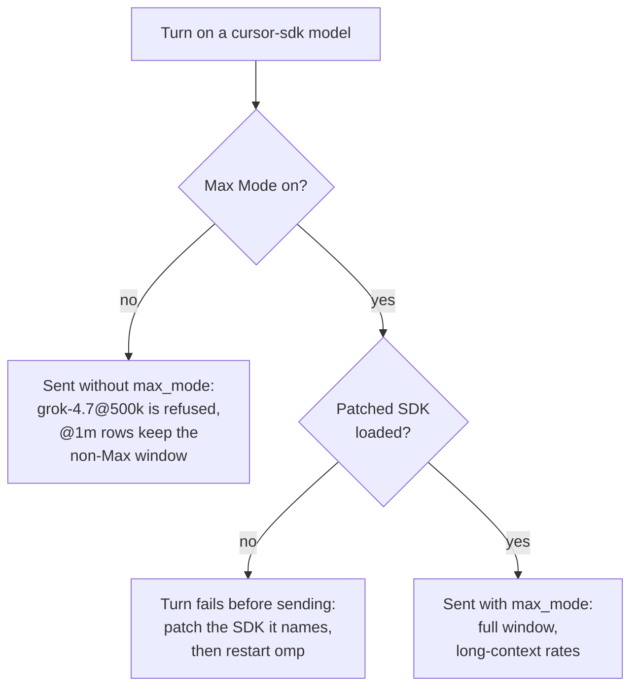

# omp-cursor-sdk

Use Cursor models from [omp](https://github.com/can1357/oh-my-pi). This plugin adds them as the
`cursor-sdk` provider. Each turn runs on your machine through the official
[`@cursor/sdk`](https://cursor.com/docs/sdk/typescript) agent, with a Cursor API key.

omp also ships a built-in `cursor` provider. The two do not share models, keys, or ids.

| | `cursor-sdk` (this plugin) | `cursor` (built into omp) |
|---|---|---|
| Sign-in | Cursor API key (`CURSOR_API_KEY`) | omp `/login` (Cursor OAuth) |
| How a turn runs | `@cursor/sdk` agent on your machine | omp's Cursor agent API |
| Model ids | `grok-4.7@256k`, `grok-4.6@fast` | `grok-4.7-high`, `grok-4.7-high-fast` |

## Install

You need omp 18.3 or newer (tested with 18.3.4). Create a key under Cursor Dashboard → API Keys.

1. Install the plugin from npm.

   ```bash
   omp plugin install omp-cursor-sdk
   ```

2. Save the key. The plugin does not write it for you.

   ```bash
   echo 'CURSOR_API_KEY=crsr_...' >> ~/.omp/.env
   ```

3. Patch the Cursor SDK. Max Mode is on by default, so the first turn fails until this copy is patched.
   Run the patch again after every install or update. The same patch stops the local
   `Co-authored-by: Cursor <cursoragent@cursor.com>` trailer. Cloud agents still add that trailer.

   ```bash
   cd ~/.omp/plugins/node_modules/omp-cursor-sdk
   node scripts/patch-cursor-sdk.mjs --sdk ~/.omp/plugins/node_modules/@cursor/sdk
   ```

4. Restart omp. The plugin, the key, and the patched SDK all load at startup.
5. Confirm the catalog.

   ```bash
   omp models cursor-sdk
   ```

Update with `omp plugin install omp-cursor-sdk --force`, then repeat steps 3 and 4.

Use the npm name above. A `github:` URL can leave the plugin half-installed. See
[The plugin did not install](#the-plugin-did-not-install).

From a git checkout, link this repo instead:

```bash
git clone https://github.com/LoneExile/omp-cursor-sdk && cd omp-cursor-sdk
npm install
npm run patch:cursor-sdk
omp plugin link "$PWD"
```

Restart omp after the link. `omp plugin uninstall omp-cursor-sdk` removes the link. It does not delete the checkout.

## Run a model

```bash
omp --model cursor-sdk/composer-2.5
omp --model cursor-sdk/grok-4.7@256k --thinking xhigh
omp --model cursor-sdk/claude-opus-5@300k@slow --thinking max
omp --model cursor-sdk/gpt-5.6-sol@272k --thinking off
```

Copy the id from `omp models cursor-sdk`. The shape is `cursor-sdk/<model>[@<context>][@fast|@slow]`.

- **Context.** A model with context choices exists only as `<model>@<context>`. Use `grok-4.7@256k` or `grok-4.7@500k`. There is no bare `grok-4.7`.
- **Thinking.** Pass the level with `--thinking`. The `thinking` column of `omp models` lists the levels that model accepts. `off` works only when Cursor has an off value.
- **Do not put the level in `--model`.** omp 18.3.4 reads `--model` before plugins load, so `cursor-sdk/grok-4.7@256k:xhigh` is "Model not found". In `modelRoles` the suffix is valid: `default: cursor-sdk/grok-4.7@256k:xhigh`.
- **Fast.** `@fast` and `@slow` pick Cursor's fast lane. Otherwise the model default applies. `/cursor-fast` saves a choice for that model. `--cursor-fast` and `--cursor-no-fast` force it for one run.
- **Window size.** Measured sizes start from a bundled table and update in `~/.omp/agent/cursor-sdk-context-windows.json`. Without Max Mode, most `@1m` rows measure 200k–300k. Cursor can refuse a large variant such as `grok-4.7@500k`.

## How a turn runs



The agent stays on your machine and calls Cursor for the model. Cursor uses its own shell and file tools. omp shows those calls as tool cards. omp's other tools reach Cursor as `pi__*` through a local bridge. [Cloud](#cloud) moves the agent to a Cursor-hosted VM.

## Max Mode

Max Mode is on unless you turn it off. It bills at Cursor's higher long-context rates. The stock `@cursor/sdk` cannot set Max Mode, so the [install patch](#install) is required. Turn it off with `--cursor-no-max-mode`, `PI_CURSOR_MAX_MODE=0`, or `/cursor-max-mode off`.



Check the patch without writing files:

```bash
cd ~/.omp/plugins/node_modules/omp-cursor-sdk
node scripts/patch-cursor-sdk.mjs --check --sdk ~/.omp/plugins/node_modules/@cursor/sdk
```

A checkout uses `npm run patch:cursor-sdk` and `npm run check:cursor-sdk-patch`.

The status line shows `max:on` while Max Mode is on. `--save-user` writes only `~/.omp/agent/cursor-sdk.json`. Project config cannot set Max Mode. Precedence is `--cursor-no-max-mode`, then `--cursor-max-mode`, then `PI_CURSOR_MAX_MODE`, then the session toggle, then the user file, then on.

`@cursor/sdk` 1.0.34 does not read `~/.cursor/cli-config.json` for the commit trailer. The trailer stays on until you patch and restart. An explicit attribution value from Cursor still wins.

## Advisors

An omp advisor on a `cursor-sdk` model gets only the read-only Cursor tools omp granted (`read`, `grep`, `glob`). It does not get Cursor's shell, edits, MCP servers, or subagents. On your machine, a summary that uses omp's summary prompt gets no Cursor tools.

Cloud cannot limit those tools. An advisor request on cloud is refused. Run that advisor on another provider. A cloud summary still has Cursor's full tool set.

## Commands

| Command | What it does |
|---|---|
| `/cursor-refresh-models` | Fetch the catalog now |
| `/cursor-fast` | Toggle fast mode for this model |
| `/cursor-max-mode [on\|off\|toggle] [--save-user]` | Max Mode for this session. `--save-user` writes the user file only |
| `/cursor-mode agent\|plan` | Cursor conversation mode |
| `/cursor-runtime local\|cloud [--save-user\|--save-project]` | Local agent or Cursor Cloud |
| `/cursor-cloud list \| archive <id> \| delete <id> --yes` | List or remove Cloud agents this plugin created |
| `/cursor-http [on\|off\|toggle]` | HTTP/1.1 transport, for networks that break HTTP/2 |
| `/cursor-refresh-config` | Reload Cursor config into the current agent |
| `/cursor-local-resume-cleanup [--dry-run\|--yes]` | Delete old local SDK agents |
| `/cursor-tools` | Show which tools this turn can call |

One-run flags: `--cursor-fast`, `--cursor-no-fast`, `--cursor-max-mode`, `--cursor-no-max-mode`, `--cursor-mode <agent|plan>`, `--cursor-runtime <local|cloud>`, and the `--cursor-cloud-*` flags.

## Settings

| Name | What to set |
|---|---|
| `CURSOR_API_KEY` | Required. Cursor API key |
| `PI_CURSOR_MAX_MODE` | `0` or `1` to force Max Mode off or on |
| `PI_CURSOR_RUNTIME` | `local` (default) or `cloud` |
| `PI_CURSOR_SETTING_SOURCES` | Cursor rules the SDK loads. `all` (default), a comma list, or `none` |
| `PI_CURSOR_SDK_EVENT_DEBUG=1` | Write a turn trace under `.debug/cursor-sdk-events/` in the working directory. Delete it after. It can contain prompts and tool output |
| `~/.omp/agent/cursor-sdk.json` | Your saved Cursor settings |
| `<cwd>/.omp/cursor-sdk.json` | Project Cursor settings. This file cannot set Max Mode |

The catalog cache lasts 24 hours (`~/.omp/agent/cursor-sdk-model-list.json`). Set `PI_CURSOR_SDK_MODEL_CACHE_TTL_MS` to change that, or `PI_CURSOR_SDK_DISABLE_MODEL_CACHE=1` to skip the cache.

Full lists: [docs/omp-integration.md](docs/omp-integration.md), [docs/cursor-model-ux-spec.md](docs/cursor-model-ux-spec.md).

## Cloud

Cloud is off until you opt in. `--cursor-runtime cloud` or `PI_CURSOR_RUNTIME=cloud` runs the agent in a Cursor VM against a Git repository. The first cloud turn needs `--cursor-cloud-ack` or `PI_CURSOR_CLOUD_ACK=1`. Uncommitted or unpushed work is rejected unless you allow it. `/cursor-cloud` lists, archives, or deletes the agents this plugin created.

## When something goes wrong

- **No `cursor-sdk` rows.** The plugin is not loaded, or it is disabled. Run `omp plugin list`. Without a key you still see a small fallback list, and turns fail until `CURSOR_API_KEY` is set. Restart omp after you add the key.
- **The plugin did not install.** The error names a missing `package.json` under `omp-cursor-sdk` or `github:LoneExile/omp-cursor-sdk`. Not every omp version maps a `github:` spec to the npm name. A failed try can leave `"omp-cursor-sdk": ""` in `~/.omp/plugins/package.json` and a duplicate `bun.lock` key. Reset, install `0.4.5`, and restart omp:

  ```bash
  cd ~/.omp/plugins
  rm -f bun.lock
  bun add omp-cursor-sdk@0.4.5
  ls node_modules/omp-cursor-sdk/package.json node_modules/@cursor/sdk/package.json
  omp plugin list
  ```

  Keep one install. A `github:` spec on top of the npm pin fails with a dependency loop.
- **`AI Model Not Found` or invalid parameters.** For a wider context, use Max Mode or the smaller id in the error (`@256k` instead of `grok-4.7@500k`).
- **The turn fails before it sends, and the error says the SDK is not patched.** Patch the path in the error, then restart omp. If it says the SDK was patched after this process started, restart omp. The running process still has the old copy.
- **`unauthenticated` with a valid key.** Cursor's backend sometimes returns this. Retry, or switch `@fast` / `@slow`.
- **Refused by account policy.** Some models need a one-time acknowledgement on the Cursor website. Claude Fable asks you to accept its data-retention policy.
- **Models look old or missing.** The catalog is cached for 24 hours. Run `/cursor-refresh-models`.
- **`Command failed to spawn`.** Cursor could not start its shell. A missing working directory is `ENOENT`. A working directory that is a file is `ENOTDIR`. omp stays up.
- **omp exits a few seconds after a turn.** Open `~/Library/Logs/DiagnosticReports/bun-*.ips`. If it says `EXC_GUARD` / `CLOSE` and guard `0x08fd4dbfade2dead`, that report is from an old process. Update the plugin and restart omp. Current builds keep the Cursor shell subprocess so Bun does not close a SQLite file.
- **The log says `Cursor's ripgrep failed to start`.** Cursor uses ripgrep for Grep, Glob, and `ls`. omp stays up. Follow the `hint` in the log. It names a bad `CURSOR_RIPGREP_PATH`, the bundled ripgrep, the working directory, or an open-file limit.
- **You need the exact request.** Set `PI_CURSOR_SDK_EVENT_DEBUG=1`, run one turn, and read `.debug/cursor-sdk-events/**/metadata.json`. Delete that folder after. It can contain prompts and tool output.

## Work on this repo

Node 22.19 or newer.

```bash
npm install
npm run patch:cursor-sdk   # required before tests that start a turn. Max Mode is on by default
npm test
npm run typecheck:src
omp -e ./src/index.ts --model cursor-sdk/composer-2.5
```

CI runs the same patch before `npm test`. An installed plugin loads next to `omp -e <repo>`. Add `--no-extensions` to use only the checkout. Maintainer rules are in [AGENTS.md](AGENTS.md).

**Release.** Update `CHANGELOG.md`, the `package.json` version, and the `bun add` pin above. Commit, then publish a GitHub Release tagged `v<version>`. [`.github/workflows/release.yml`](.github/workflows/release.yml) publishes that tag to npm. `0.4.0` was published by hand once, to create the npm package.

## Credits and license

Port of [fitchmultz/pi-cursor-sdk](https://github.com/fitchmultz/pi-cursor-sdk) by Mitch Fultz, adapted for omp. MIT licensed. See [LICENSE](LICENSE).
